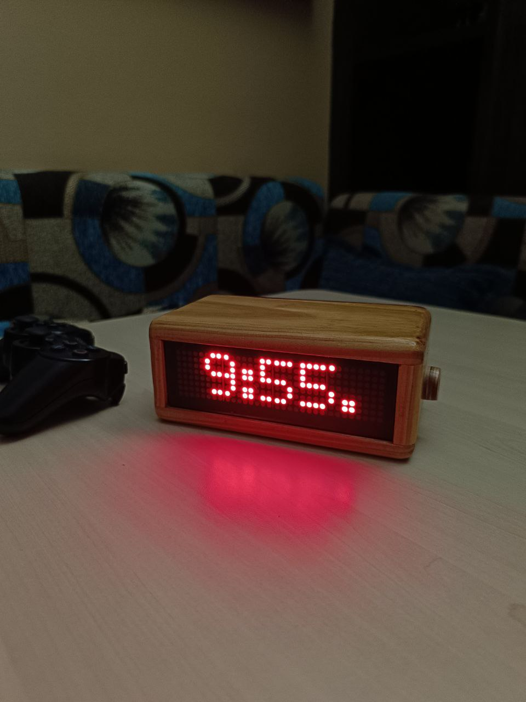

# 🚀 ESP32 LED Matrix Smart Dashboard

A professional, feature-rich IoT dashboard built on ESP32 that integrates Time, Weather, Prayer Times, and Telegram control into a sleek 8x32 LED Matrix.



## 🌟 Key Features

*   **Dynamic Display**: Rotates between Time, Date (with Weather), and custom Telegram messages.
*   **Interactive Telegram Control**: Full "Control Panel" via Telegram Inline Keyboards. No need to type commands—just tap buttons!
*   **Live Weather Integration**: Real-time temperature and weather glyphs (☀️, ☁️, 🌧️, 🌙) for Damascus (Open-Meteo API).
*   **Automated Prayer Times (Azan)**: Fetches daily timings via Aladhan API with automatic audio support (Athan) using a DFPlayer Mini.
*   **Remote OTA Updates**: Update the device firmware anywhere in the world by sending a `.bin` file directly to the Telegram bot.
*   **Local Menu System**: Full on-device configuration using a Rotary Encoder.
*   **Smart Connectivity**: Automatic WiFi configuration portal (Captive Portal) and robust internet recovery logic.
*   **Watchdog Protected**: Industrial-grade safety logic that prevents freezes and ensures 24/7 uptime.

---

## 🛠 Hardware Requirements

| Component | Description |
| :--- | :--- |
| **ESP32 DevKit V1** | The brain of the project. |
| **MAX7219 LED Matrix** | 4-in-1 Module (8x32 pixels), FC-16 Hardware type. |
| **DS3231 RTC Module** | High-precision Real-Time Clock with battery backup. |
| **Rotary Encoder** | EC11 with push-button for local menu navigation. |
| **DFPlayer Mini** | MP3 module for Azan and Alarm audio. |
| **8 Ohm Speaker** | Small speaker for audio output. |
| **Micro SD Card** | For storing MP3 files for the DFPlayer. |

---

## 🔌 Wiring & Pinout

### 1. LED Matrix (SPI)
| ESP32 Pin | Matrix Pin |
| :--- | :--- |
| **5V / VCC** | VCC |
| **GND** | GND |
| **GPIO 23 (MOSI)** | DIN |
| **GPIO 18 (SCK)** | CLK |
| **GPIO 5 (CS)** | CS |

### 2. DS3231 RTC (I2C)
| ESP32 Pin | RTC Pin |
| :--- | :--- |
| **3.3V** | VCC |
| **GND** | GND |
| **GPIO 21 (SDA)** | SDA |
| **GPIO 22 (SCL)** | SCL |

### 3. Rotary Encoder
| ESP32 Pin | Encoder Pin |
| :--- | :--- |
| **GPIO 33** | Output A (CLK) |
| **GPIO 25** | Output B (DT) |
| **GPIO 32** | Push Button (SW) |
| **GND** | GND |

### 4. DFPlayer Mini (Serial2)
| ESP32 Pin | DFPlayer Pin |
| :--- | :--- |
| **5V / VCC** | VCC (Pin 1) |
| **GND** | GND (Pin 7) |
| **GPIO 17 (TX2)** | RX (Pin 2) - *Use 1k resistor if noisy* |
| **GPIO 16 (RX2)** | TX (Pin 3) |

---

## 💻 Software Setup

### 1. Requirements
*   **PlatformIO** (VS Code Extension recommended).
*   **Micro SD Card**: Format as FAT32. Create a folder named `01` and put your Azan/Alarm MP3s inside.

### 2. Library Dependencies
The project automatically manages dependencies via `platformio.ini`:
*   `MD_Parola` & `MD_MAX72XX` (Display)
*   `AsyncTelegram2` (Bot API)
*   `ArduinoJson` v6.21+ (Data Parsing)
*   `IotWebConf` (WiFi Config)
*   `RTClib` (RTC Control)
*   `DFRobotDFPlayerMini` (Audio)

### 3. Telegram Bot Configuration
1. Message [@BotFather](https://t.me/botfather) on Telegram to create a new bot.
2. Copy your **API Token**.
3. Open `src/telegram/telegram.cpp` and replace:
   ```cpp
   #define BOT_TOKEN "YOUR_TOKEN_HERE"
   ```
4. Message [@IDBot](https://t.me/myidbot) to get your personal **Chat ID**.
5. Replace in `src/telegram/telegram.cpp`:
   ```cpp
   #define CHAT_ID "YOUR_ID_HERE"
   ```

---

## 📲 Usage

### Initial WiFi Setup
1. On first boot, the ESP32 creates a WiFi hotspot named **"testThing"**.
2. Connect to it (Password: `m12345678`).
3. Your phone should open a portal (or go to `192.168.4.1`).
4. Enter your home WiFi credentials and save. The device will reboot and connect.

### Telegram Dashboard
Send `/start` to your bot to open the **Live Dashboard**.
*   **📝 Msg**: Send a text message to scroll it on the matrix.
*   **🔔 Ring**: Test the alarm speaker.
*   **🕒 Time**: Interactive menu to set system time.
*   **🔊 Vol**: Quick volume presets.
*   **⏰ Set**: Interactive menu to adjust hours, minutes, and AM/PM for the alarm.
*   **⏰ ON/OFF**: Instant toggle for the alarm.
*   **🕋 Azan**: Toggle the automated prayer call.
*   **🌤 Weather**: Manually force a refresh of the weather data.

### Local Control (Rotary Encoder)
The device features a complete on-device menu system for offline configuration.
1.  **Enter Menu**: Long-press the encoder button for 1 second.
2.  **Navigate**: Rotate the knob to cycle through the options below.
3.  **Select**: Long-press to enter a sub-menu or confirm a setting.

**Available Local Menus:**
*   `Time`: Set Hour, AM/PM, Minute, Day, Month, and Year.
*   `Alarm`: Set Alarm Hour, AM/PM, and Minute.
*   `Bright`: Adjust LED intensity (1-8).
*   `AlStat`: Toggle Alarm status (ON/OFF).
*   `Volume`: Adjust speaker volume (0-30).
*   `Music`: Cycle through and preview alarm sounds on the SD card.
*   `PrStat`: Toggle Prayer/Azan status (ON/OFF).
*   `Exit`: Return to the main display.

### Remote OTA Update
1. Build your project in PlatformIO.
2. Send the resulting `.bin` file as a **Document** to your Telegram bot.
3. The bot will recognize the file. Type **`update`** to confirm.
4. The matrix will scroll **"UPDATING..."** and reboot once finished.

---

## 📂 Project Structure

*   `src/display/`: Animation logic and font management.
*   `src/telegram/`: Bot logic, keyboards, and OTA handler.
*   `src/weather/`: Open-Meteo API integration.
*   `src/prayerTime/`: Aladhan API fetching and scheduling.
*   `src/time/`: RTC management and alarm triggering.
*   `src/encoder/`: Local menu navigation logic.

---

## 📜 License
This project is open-source. Feel free to modify and share!
